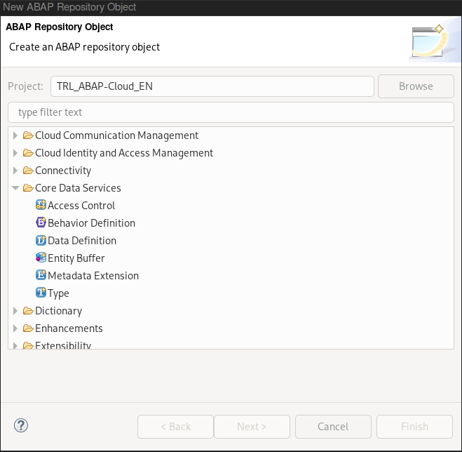

# ABAP Programming model for SAP Fiori

"The ABAP Programming Model for SAP Fiori defines the architecture for efficient end-to-end development of intrinsically SAP HANA-optimized Fiori apps in SAP S/4HANA. It supports the development of all types of Fiori applications (...) and is based on modern technologies such as CDS, BOPF ((Business Objects Processing Framework)[[4]](https://community.sap.com/topics/abap/bopf), ODATA, ABAP-based application services for custom logic and SAPUI5-based user interfaces" [[3]]((https://help.sap.com/doc/3750bcdf7b8045e18f1b759e6d2b000b/2020%20FPS00/en-US/ABAP_Programming_Model_for_Fiori_EN.pdf)). Some reasons why you might want to consider using the ABAP programming model for SAP Fiori are:

<ol>
    <li>Rapid application development: The ABAP programming model for SAP Fiori provides a set of pre-built user interface (UI) patterns and templates that allow developers to create SAP Fiori applications quickly and consistently. By using these patterns and templates, developers can focus on implementing business logic rather than building UI components from scratch.</li>
    <li>Consistent user experience: SAP Fiori elements are designed to provide a consistent user experience across all SAP Fiori applications. This means that users can easily navigate and use applications that follow the same design principles and patterns, which can help improve user adoption and satisfaction.</li>
    <li>Using Freestyle SAPUI5 apps gives you flexibility, in case SAP Fiori elements apps are not sufficient.</li>
    <li>Integration with SAP technologies: The ABAP programming model for SAP Fiori integrates with other SAP technologies such as SAP Gateway and SAP OData services, which can simplify integration with other SAP systems and data sources.</li>
</ol>

Overall, the ABAP programming model for SAP Fiori can help developers create high-quality SAP Fiori applications quickly and consistently, with a focus on business logic rather than UI components. For an overview of the [Evlotion of the ABAP Programming Model - see here](https://blogs.sap.com/2019/02/08/evolution-of-the-abap-programming-model/).

> **Warning**
>Be aware, the ABAP Programming model for SAP Fiori is not the latest evolution. The most current way to develop OData services in the SAP environment is the "ABAP RESTful Application Programming Model (RAP)."

## Prerequisites

You would need an ABAP System >= Netweaver 7.50 and access to a SAP Gateway system.
BTP: [SAP BTP Trial](https://www.sap.com/products/technology-platform/trial.html)
ABAP Environment: [Create an SAP BTP ABAP Environment Trial User](https://developers.sap.com/tutorials/abap-environment-trial-onboarding.html)


## Steps for implementation

<ol>
<li>Create a CDS views (Interface and Consumption) as Data Model (DDL) in ADT</li>
<li>Generate OData Service with auto-exposure based on SADL (Service Adaptation Description Language) by adding the annotation “@OData.publish:true” to the CDS.
(see here for different possibilities: Exposing CDS Entities as OData Service – SAP Help Portal). As a result “several SAP Gateway artifacts” are being created, which need to be activated in the SAP Gateway Hub for exposure (/n/IWFND/MAINT_SERVICE).</li>
<li>(3) Consume data (test using the SAP Gateway Client)</li>
<li>(4) Create a SAP Fiori Elements application</li>
</ol>

For details see:
[SAP - ABAP Programming Model for SAP Fiori](https://help.sap.com/docs/SAP_NETWEAVER_AS_ABAP_751_IP/cc0c305d2fab47bd808adcad3ca7ee9d/32bc41261af445e08182c8532032f950.html?locale=en-US)


### Create a package and a dictionary table

<br/>

> **Note**
> You can skip this step, in case you access a standard table or a nested CDS-view.

- Create a new packge *ZDPU*
- Create a table *ZSALES* with the structure like:

```js
    key Item.SalesOrder                          as SalesOrderID, 
	key Item.SalesOrderItem                      as ItemPosition, 
	Item._SalesOrder._Customer.CompanyName  	as CompanyName,
	Item.Product                            	as Product, 
	@Semantics.currencyCode: true
	Item.TransactionCurrency                	as CurrencyCode,
	@Semantics.amount.currencyCode: 'CurrencyCode'
	Item.GrossAmountInTransacCurrency       	as GrossAmount, 
	@Semantics.amount.currencyCode: 'CurrencyCode'
	Item.NetAmountInTransactionCurrency     	as NetAmount, 
	@Semantics.amount.currencyCode: 'CurrencyCode'
	Item.TaxAmountInTransactionCurrency     	as TaxAmount,
	Item.ProductAvailabilityStatus          	as ProductAvailabilityStatus
```
This acts as a data-source for the next steps.


### CDS-View as data model

A data model based on CDS-views consists of the following parts: 
- a **data definition** for the CDS view. This represents the ABAP development object used to define the ABAP CDS entity.
- the **implementation** of this CDS view as a data model.

Steps:
- Use ADT to create a **DDL Source - "Data Definition"** named *ZDPU_DDL_BUT000* using the "Define View" Template. This projection view acts as a new data model using a data source that has been predefined in the previous step.

   

In the **implementation** add fields and annotation. 
With the following coding, you'll get an error message.

```js
@AbapCatalog.sqlViewName: 'ZDEMO_DPU'
@AbapCatalog.compiler.compareFilter: true
@AbapCatalog.preserveKey: true
@AccessControl.authorizationCheck: #NOT_REQUIRED
@EndUserText.label: 'List Report for BUT000'
define view ZDPU_DDL_BUT000 
as select from BUT000 as Item
{
    contact
}
```

BUT000 is a standard SAP Table which is used to store BP: General data and is available within R/3 SAP systems. In ABAP Cloud systems (BTP) you cannot access this table directly.
Instead use the released object I_BUSINESSPARTNER. Be careful, a key needs to be specified, otherwise the service cannot be activated.

```js
@AbapCatalog.sqlViewName: 'ZDEMO_DPU'
@AbapCatalog.compiler.compareFilter: true
@AbapCatalog.preserveKey: true
@AccessControl.authorizationCheck: #NOT_REQUIRED
@EndUserText.label: 'List Reporting for I_BUSINESSPARTNER'
define view ZDPU_DDL_BUSINESSPARTNER
as select from I_BUSINESSPARTNER as Item
{
	contact
}
```

When the DDL source is activated, the following objects are created in ABAP Dictionary:
<ul>
<li>The actual entity of the CDS view *ZDPU_DDL_BUSINESSPARTNER*</li>
<li>An SQL view ZDEMO_DPU</li>
</ul>


### Auto-expose OData service

Using the OData auto-exposure feature the OData service is *"automatically"* created and activated based on SADL (Service Adaptation Description Language). The only requirement for this is to add the annotation "@OData.publish:true". Afterwards you need to  use transaction "/IWFND/MAINT_SERVICE" to add the OData service to the service catalogue of the SAP Gateway hub.

```js
@OData.publish:true
```

For details for when and when not to use this feature check [[3, p.19,p.339]](https://help.sap.com/doc/3750bcdf7b8045e18f1b759e6d2b000b/2020%20FPS00/en-US/ABAP_Programming_Model_for_Fiori_EN.pdf)

When the service is exposed, the following artifacts are created in the ABAP Dictionary:
<ul>
<li>The actual service object *ZDPU_DDL_BUSINESSPARTNER_CDS* (R3TR, IWSV)</li>
<li>The SAP Gateway model *ZDPU_DDL_BUSINESSPARTNER_CDS* (R3TR, IWMO)</li>
<li>An ABAP class to provide the metadata of the OData service *CL_ZDPU_DDL_BUSINESSPARTNER* (R3TR, CLASS)</li>
</ul>

On activation, the following artifacts are created in the ABAP Dictionary:
<ul>
<li>Service Group metadata *ZDPU_DDL_BUSINESSPARTNER_CDS_1* (R3TR, IWSG)</li>
<li>The SAP Gateway model metadata *ZDPU_DDL_BUSINESSPARTNER_CDS_1_BE* (R3TR, IWOM)</li>
<li>An ICF node (R3TR, SICF)</li>
</ul>

### Test the OData service

using the "SAP Gateway Client". You can also see the "Generated Object" in ADT when hovering over the CDS view annotation, as well as a decorator indicates the "successfully activated OData service".


### Consume service via SAP Fiori Elements

tbd...


## more...

https://blogs.sap.com/2017/07/04/maintain-businesspartner-master-data-using-odata-apis-in-a-sap-s4hana-cloud-system/


## Resources

See [(1) About ABAP Programming Model for SAP Fiori](https://help.sap.com/docs/SAP_NETWEAVER_750/cc0c305d2fab47bd808adcad3ca7ee9d/3b77569ca8ee4226bdab4fcebd6f6ea6.html?locale=en-US) for a detailed step-by-step guide, as well as the blog-post by Andre Fischer [(2) How to develop a transactional app using the new ABAP Programming Model for SAP Fiori](https://blogs.sap.com/2017/09/14/how-to-develop-a-transactional-app-using-the-new-abap-programming-model-for-sap-fiori/)

[(3) SAP 600 page pdf on "SAP (On-Premise - ABAP Programming Model for SAP Fiori)](https://help.sap.com/doc/3750bcdf7b8045e18f1b759e6d2b000b/2020%20FPS00/en-US/ABAP_Programming_Model_for_Fiori_EN.pdf)
[(4) BOPF - Introduction to Business Object Processing Framework](https://community.sap.com/topics/abap/bopf)


