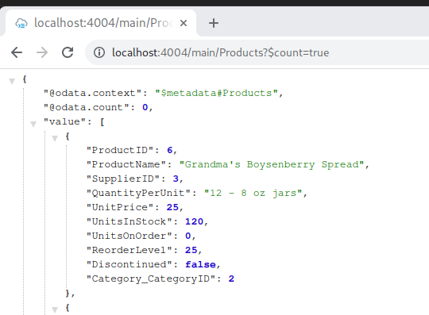
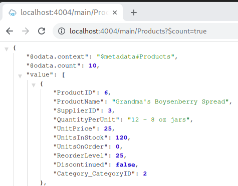

# OData by Example

These are some code-snippets and examples for OData.
The examples are implemented using [SAP CAP](https://cap.cloud.sap/docs/) (Cloud Application Programing model), and are based on various example-data, starting with OData.org services Northwind and TripPin. The examples described below can be found in the corresponding subfolders. SAP Gateway examples may be added in the future.

Last Updated: 27.11.2022 <br>
Status: Released <br>


For background information see:<br>
[SAP Community - Daniel Purucker: Howto OData – High level overview](https://blogs.sap.com/2022/01/22/howto-odata-high-level-overview/)<br>
[Github - SAP Samples, OData Handsonsapdev](https://github.com/SAP-samples/odata-basics-handsonsapdev)<br>
[https://www.odata.org/](https://www.odata.org/)


# Example 1 - Direct access to a sample OData service

These examples are based on the [odata.org TripPin service](https://www.odata.org/blog/trippin-new-odata-v4-sample-service/). There are also original samples from [odata.org](https://github.com/ODataOrg/tutorials) - use these to get the fist-hand information. The examples here are stripped down and adjsuted for my needs. For an overview see the file "odata-requests.md".

The calls can be directly used in the browser, via [curl](https://curl.se/) or [postman](https://www.postman.com/).


Resources:
https://www.odata.org/getting-started/understand-odata-in-6-steps/ <br>
https://www.odata.org/getting-started/basic-tutorial/ <br>
https://www.odata.org/odata-services/service-usages/trippin-advanced-usages/ 


# Example 2 - OData service and CDS using CAP

This first example is described in the [walkthrough "Build Your First OData-Based Backend Service"](https://developers.sap.com/group.scp-8-odata-service.html).
It basically consists of CDS-views for modeling the entites ([domain modeling](https://cap.cloud.sap/docs/guides/domain-models)) and service-definition. The OData service is provided by SAPs CAP, initial data is provided by [csv-files](https://cap.cloud.sap/docs/guides/databases#providing-initial-data). It's mindblowing to see, that you actually only need to create 3 files (including the actual data in csv-format) to get an working OData service. It's a stripped-down implementation of the famous [Northwind example service](https://services.odata.org/V4/Northwind/Northwind.svc/$metadata).
The csv-files can be found at [https://github.com/neo4j-contrib/northwind-neo4j/tree/master/data](https://github.com/neo4j-contrib/northwind-neo4j/tree/master/data).


Folders:
- app/ = Frontend, eg. the UI5 application goes here (optional)
- srv/ = business logic & service definition
- db/  = entity definition and database/persistence layer

Basic service:

|File | Description | Comment |
|--|--|--|
| db/schema.cds | entity-definition | firstly only contains products |
| db/data/northwind-Products.csv| The actual data | currently for one entity products |
| srv/service.cds | service-definition | simple, as projection |

Enhanced service with relation:

|File | Description | Comment |
|--|--|--|
| db/schema.cds | entity-definition | changed: added entity categories |
| srv/service.cds | service-definition | changed: added exposure of categories |
| db/data/northwind-Products.csv| changed: added foreign key relation to categories | |
| db/data/northwind-Categories.csv| The actual data | new file for categories |
| srv/service.cds | service-definition | no change |

Relation is made via:

```cds
namespace northwind;

entity Products {
    key ProductID    : Integer;
		... rest omitted ...
        Category     : Association to Categories;

entity Categories {
    key CategoryID   : Integer;
        CategoryName : String;
        Description  : String;
        Products     : Association to many Products
                           on Products.Category = $self;
}
```

Relevant part in the medadata xml:

```xml
<NavigationProperty Name="Category" Type="Main.Categories" Partner="Products">
<ReferentialConstraint Property="Category_CategoryID" ReferencedProperty="CategoryID"/>
</NavigationProperty>
```

OData-Queries:

```
http://localhost:4004/main/Products(1)
http://localhost:4004/main/Products?$filter=ProductName eq 'Chai'
http://localhost:4004/main/Products?$count=true
http://localhost:4004/main/Products?$expand=Category
http://localhost:4004/main/Products?$filter=ProductName eq 'Chai'&$expand=Category
http://localhost:4004/main/Products?$filter=Category_CategoryID%20eq%202&$expand=Category
http://localhost:4004/main/Products?$expand=Category($filter=CategoryName eq 'Beverages')&$count=true --> currently leads to "Allowed query option expected"... tbd
```

Notes:
- Foreign key relation / association in this case is "managed"
- the Referential constraint can be seen in the metadata xml - use this property in the csv-file.
- The name of the csv-File corresponds to the namespace and entity.
- Nested filters in expand can be tricky (and only possible in OData v4 - get info using "cds env", CAP is default v4)

Resources:
[Domain modeling with CDS](https://cap.cloud.sap/docs/guides/domain-models)
[CAP on associations](https://cap.cloud.sap/docs/guides/domain-models#associations--structured-models)
[OData Querying data](https://www.odata.org/getting-started/basic-tutorial/)


# Example 2a - Added business logic with CAP

## service definition and implementation

The data model is the same as in example one. However, there is some logic added by adding [event handlers](https://developers.sap.com/tutorials/odata-07-extend-custom-code.html). This is not specific to OData, but *provided by SAP CAP*.

The logic - or so called service implementation - is added in a "sibling .js files next to .cds sources" with the same name (see [SAP CAP - How to Implement Services](https://cap.cloud.sap/docs/node.js/services#srv-impls)). The file could as well be placed in a ./lib or ./handlers subfolder.

|File | Description | Comment |
|--|--|--|
| srv/service.cds | service-definition | no change |
| srv/service.js | service-implementation | added in the same folder |

There are are several **event handlers to be registered** through the [Handler Registration API](https://cap.cloud.sap/docs/node.js/services#event-handlers). Cheat-sheet on when to use which handler:

|Event | Description | use-case |
|--|--|--|
| srv.on | run in sequence  | filtering results or replace default behaviour completely |
| srv.before | runs before srv.on() and generic handlers | add custom input validation |
| srv.after | runs after generic handlers *on the results* | modify response |
| srv.reject | "automatically rejects incoming requests with a standard error message" | |
| srv.prepend | before already registered handlers | override handlers from reused services |


The general structure of the Node.js module export mechanism and the called anonymous function is:

```js
module.exports = srv => {
    srv.event('READ','entity', items => {
        return...
    })
}
```

Example for filtering at srv.on:

```js
module.exports = srv => {
    srv.on('READ', 'Products', async (req, next) => {
        const items = await next()
        return items.filter(item => item.UnitsInStock > 100)
    })
}
```

Be aware, when implementing this filter, the argument ?$count=true doesn't work any longer - and Fiori elements doesn't show the data - kind of not so nice!
see [answers.sap.com - CAP Custom event handlers & OData queries](https://answers.sap.com/questions/12966178/cap-custom-event-handlers-odata-queries.html): "Most query options like $filter and $sort are pushed to the database and not applied to the result set your custom handler returns. Hence, you must deal with those yourself."

```bash
http://localhost:4004/main/Products?$count=true
```


Resources:
[SAP CAP - How to Implement Services](https://cap.cloud.sap/docs/node.js/services#srv-impls) <br>
[SAP CAP - Handler Registration API](https://cap.cloud.sap/docs/node.js/services#event-handlers) <br>


## functions in CAP (1)

Example 3 was to enhance standard OData operations, Example 4 will implmement a stand-alone function. As in other programing languages, according to the OData specification there is also an declaration and implementation needed. In CAP the function is **declared** in the *srv/service.cds* file. The **implementation** is located in the *srv/service.js* file.

The line "function TotalStockCount() returns Integer;" is added for declaring the function in srv/service.cds:

```js
using northwind from '../db/schema';

service Main {
    entity Products as projection on northwind.Products;
    entity Categories as projection on northwind.Categories;
    function TotalStockCount() returns Integer;
}
```

Implementation in srv/service.js:

```js
srv.on('TotalStockCount', async (req) => {
        const items = await cds.tx(req).run(SELECT.from(Products))
        return items.reduce((a, item) => a + item.UnitsInStock, 0)
    })
```

So the relevant files are:

|File | Description | Comment |
|--|--|--|
| srv/service.cds | service-definition | added declaration of a function |
| srv/service.js | service-implementation | added implementation |

Call via: localhost:4004/main/TotalStockCount()

Resources:
[Tutorial - Extend the Built-In OData Features with Custom Code](https://developers.sap.com/tutorials/odata-07-extend-custom-code.html)


# Example 2b - Fixes for CAP

## Re-implement count=true

As said earlier, with the custom implementation, the "$count=true" doesn't work any lnger. However that's a prerequisite of Fiori Elements to work (Test it, the Fiori preview of Products doesn't show any data in examlpe 3). So it's re-implemented here - but it's mere a workaround as it only shows the number of returned records.

This topic has been discussed in several threads at SAP, eg.
https://answers.sap.com/questions/13190095/fiori-preview-of-external-odata-northwind-product.html


```js
  srv.after('READ', 'Products', (Products,req) => {
    if(Products && Products.length) {
      Products.$count = Products.length
    }
  })
```

Before implementation:
 

After implementation:
 


# Example 3 - Code based implementation and classical SEGW

Disclaimer - This way of creating an OData service is [not suggested imho](https://blogs.sap.com/2021/05/19/a-step-by-step-process-to-post-odata-services-in-sap-sap-hana-system/comment-page-1/#comment-587808), as it's
- quiet complicated
- can't be exported to file-only definitions
- there are better ways available (see Examples 4 and 5)

"The “SAP Gateway Service Builder” (transaction SEGW) can be used to create an OData service. It’s a half-graphical modeling tool – using a code-based approach to build the CRUDQ methods (Create, Read, Update, Delete). (...) This method for creating OData services had been available since ABAP platform <= 7.4, but will still continue to work in newer release like S/4. The used OData-Version is V2." for more see: [Howto OData - High level overview](https://blogs.sap.com/2022/01/22/howto-odata-high-level-overview/)

The steps, which need to be taken, are:
(1) in SEGW create a project and eg. import a DDIC structure for the data model
(2) in SEGW generate the MPC and DPC classes
(3) in /IWFND/MAINT_SERVICE publish the service and test in the "SAP GAteway Client"
(4) add logic to the MPC_EXT and DPC_EXT classes by redefining the methods (see below for details)
(5) in the "SAP GAteway Client" test "EntitySets"


The folders in the SEGW projects are:

|Folder | Description |
|--|--|
| Data Model | contains the data definition (entity types (=structre) and entity sets (=table)), as well as the relations (associations) |
| Service Implementation | Operations on the entities of the "data model" are defined here |
| Runtime Artifacts | Generated Classes |
| Service maintenance | Details of the service |


Relevant artifacts are:

|File | Description | Comment |
|--|--|--|
| Z_DPU_DEMO1| SEGW Project | Name of the OData service |
| BUT000 | Import DDIC structre | eg. BusinessPArtner BUT000, Partner is Key-field |
| ZCL_Z_DPU_DEMO1_MPC| Technical Model - Base Class (MPC) | generated - do not modify |
| ZCL_Z_DPU_DEMO1_MPC_EXT | Technical Model - Base Class (MPC-EXT) | Extension - put additions here|
| ZCL_Z_DPU_DEMO1_DPC | Data Provider - Base Class (DPC) | generated - do not modify |
| ZCL_Z_DPU_DEMO1_DPC_EXT | Data Provider - Base Class (DPC-EXT) | Extension - put additions here |
|  | Technical Model Name |  |
|  | Technical Service Name |  |

The URL after registering the service in /IWFND/MAINT_SERVICE is:
http://YourSystemURL:Portnumber/sap/opu/odata/Z_DPU_DEMO1/$metadata

It can be tested - as before - via postman and curl, or directly within the system via the "SAP Gateway Client".

Keep in mind that this way the service gives no results yet, but a <b>“501” error (not implemented)</b>. As mentioned earlier, this needs to done in the DPC_EXT class, where the CRUD methods can be implemented.

Example implementation for the GET_ENTITYSET (Get all entries).
Call it using http://YourSystemURL:Portnumber/sap/opu/odata/Z_DPU_DEMO1/businesspartners 

```abap
METHOD businesspartners_get_entityset. "Redefinition 
    SELECT * FROM but000 
        INTO CORRESPONDING FIELDS OF TABLE @et_entityset
        UP TO 50 rows. 
ENDMETHOD. 
```

Example implementation for the GET_ENTITY (Get single entry)
Call it using http://YourSystemURL:Portnumber/sap/opu/odata/Z_DPU_DEMO1/businesspartners('12345')​ for selecting a single intem.

```abap
see details in sub-folder 3_segw
```

The same way support for query-options, as well as the rest of the CRUD methods need to be implemented (even though the static methods of the class /iwbep/cl_mgw_data_util will do sorting, filtering and paging). You may fear already - this is a lot of work... But don't worry, there are easeier ways.
The complete example can be found in the sub-folder 3_segw.